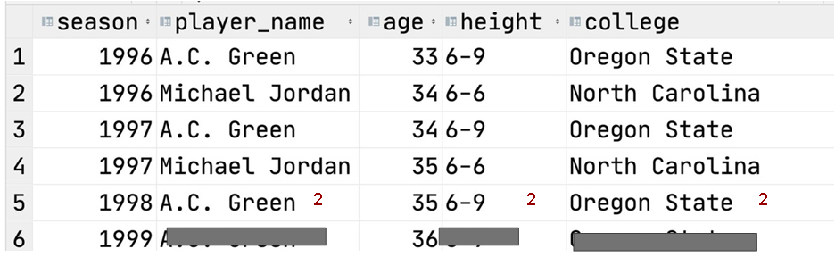

# Dimensional Data Modelling - Cumulative Table Design

## Table of Contents

- [Knowing your data consumer](#knowing-your-consumer)
- [OLTP vs OLAP data modelling](#oltp-vs-master-data-vs-olap)
- [Cumulative Table design](#cumulative-table-design)
- [The compactness vs usability trade-off](#compactness-vs-usability-trade-off)
- [Temporal cardinality explosion: When modelling dimensions having temporal component in them](#temporal-cardinality-explosions-of-dimensions)
- [Run-length encoding compression gotchas: When using Parquet files.](#run-length-encoding-compression)
- [Workshop](#workshop)

## Dimension

- Dimensions are attributes of an entity (e.g. user’s birthday, user’s favourite food)
    - Identifier dimensions: Some of these dimensions may uniquely IDENTIFY an entity (e.g. a user’s ID, Social security number, IMEI number)
    - Others are just attributes
- Dimensions come in two flavours
    - Slowly-changing (e.g., my favourite fruit, ): attribute is time-dependent & slowly changing
    - Fixed (my birthday, phone's manufacturer). Lot easier to model.

## Knowing your Consumer

Who is going to use your data? Empathy towards data user.
- Data analysts / Data scientists
  - Should be very easy to query. Not many complex data types. All the columns should be simple ones. Don't make their work hard by using complex/nested data types.
- Other data engineers
  - Should be compact and probably harder to query.
  - Nested types & structs are okay
  - Master data sets are used by other data engineers to generate more data.
- ML models
  - Depends on the model and how its trained
  - Kind of similar to what data analysts & data scientists want.
  - Flat data types
- Customers
  - Should be a very easy to interpret chart/geometric patterns. Lot of good annotations.
  - They don't need to look at excel sheets.

## OLTP vs master data vs OLAP

3 types of data modelling in a continuum: 
1. OLTP (online transaction processing)
   - Optimizes for low-latency, low-volume queries
   - Split apart in multiple tables
   - Software engineers do this to make their applications as fast as possible.
   - Mostly working in RDBMS: JOINs, normal form, no deduplication

2. OLAP (online analytical processing)
   - Optimizes for large volume, GROUP BY queries
   - Minimizes JOINs
   - Not much worry about deduplications.
   - We look at whole world.

3. Master Data
   - Sits in middle of OLTP & OLAP
   - Helps matching needs to business value
   - Optimizes for completeness of entity definitions, deduped

Mismatching needs = less business value!!!!
- Some of the biggest problems in data engineering occur when data is modelled for the wrong consumer!

## OLTP and OLAP IS A CONTINUUM


- Production Database snapshots: Host, guest, listings, pricing, availability, etc. All dimensions modelled in a transactional way.
- Master Data: Take all the dimensions from Production database and merge them to make easy to understand price & availability. One table from 40 tables. Still normalised & deduped.
- OLAP cubes: Slice & dice. Flatten the data out. Might have multiple rows per entity. Aggregated: By country, by age group, by device/OS. Used by data analyst & scientists.
- Metrics: Aggregating 1 table to a single number. e.g., average price.

## Cumulative Table Design


Master data should still hold on to an entity with its complete history.
- Core components
  - 2 dataframes/data tables (yesterday and today)
  - FULL OUTER JOIN the two data frames together
  - COALESCE IDs to keep everything around (because they might or might not match)
    - Any entity in both tables will result in only single row.
  - Columns in those 2 tables should be essentially same
  - Hang onto all of history
  - Keeps getting bigger & bigger every single day
  - Compute cumulation metrics:
    - Since how long a user has been active/inactive
    - Collect values
  - Cumulated output: Today's cumulated output will become tomorrow's input.
- Usages
  - Growth analytics at Facebook (dim_all_users: looked at every user's activity everyday so that we could see who was daily/weekly/monthly)
  - State transition tracking
    - Growth accounting
      - Churned: User is not active today, but was active yesterday
      - Resurrected: if he is active today, but not active yesterday.
      - New: Not existed yesterday
      - Kick user out of table if he is not active for more than 180 days. No need to run analysis for him.
    - we will cover this more in Analytics track, Applying analytical patterns later
- Strengths
  - Historical analysis without shuffle. No need of group-by
    - All of the history of user is collected in cumulative table
    - You can see when they were last active
    - You can have last 30 days of data in one row and it's just an array
  - Easy “transition” analysis: Churned, Resurrected, New, etc.
- Drawbacks
  - Can only be back-filled sequentially
  - Handling PII data can be a mess since deleted/inactive users get carried forward

## Compactness vs usability trade-off

- The most usable tables usually
  - Have no complex data types
  - Easily can be manipulated with WHERE and GROUP BY
  - Used in OLAP cube layer: When analytics is the main consumer and the majority of consumers are less technical
- The most compact tables (not human readable)
  - Are compressed to be as small as possible and can’t be queried directly until they’re decoded
  - Online systems where latency and data volumes matter a lot. OR, consumers are usually highly technical. Useful for data transfer to mobile App.
- The middle-ground tables
  - Use complex data types (e.g. ARRAY, MAP and STRUCT), making querying trickier but also compacting more
  - Master data layer: Upstream staging / master data where the majority of consumers are other data engineers

### Struct vs Array vs Map

- Struct
  - Like a table inside a table.
  - Keys are rigidly defined, compression is good!
  - Values can be any type
- Map
  - Keys are loosely defined, compression is okay!
  - Values all have to be the same type
- Array
  - Ordinal
  - List of values that all have to be the same type. That data type can be a complex one.

## Temporal Cardinality Explosions of Dimensions

When you have a dimension that has a time component to it. For e.g., listing can have a calendar: nights
When you add a temporal aspect to your dimensions and the cardinality increases by at least 1 order of magnitude
Example: Airbnb has ~6 million listings
- If we want to know the nightly pricing and available of each night for the next year
  - That’s 365 * 6 million or about ~2 billion nights
- Should this dataset be:
  - Listing-level with an array of nights? Complex data type
  - Listing night level with 2 billion rows? Flattened out table.
- If you do the sorting right, Parquet will keep these two about same size

Badness of denormalized temporal dimensions
If you explode it out and need to join other dimensions, Spark shuffle will ruin your compression!
- If we have a flattened out table stored by listing night level, and if we do a JOIN, Spark shuffle is going break/mess with the sorting.
- As soon sorting is gone, the Parquet will no longer will be able to to Run-length encoding compression.

## Run-length encoding compression

- Probably the most important compression technique in big data right now
  - It’s why Parquet file format has become so successful
  - If you have duplicate data for a column, Parquet will store value only once and then the number it neds to be repeated.
- Shuffle can ruin this. BE CAREFUL!
  - Shuffle happens in distributed environments when you do JOIN and GROUP BY


After run-length encoding compression, it will look like:


## Spark Shuffle

After a join, Spark may mix up the ordering of the rows and ruin your compression:



### Solutions
1. Resort your data after JOIN. Unpreferred.
2. Keep everything in an array:
   a. One row with a player name and an array with all of the seasons he played in
   b. We can JOIN on player name: Works great
   c. After the JOIN, we can explode out the seasons array. It keeps the sorting
   d. Leveraging this concept in master data can be very powerful for your downstream data engineers, because they can't make that mistake.

## Workshop

- From <https://bootcamp.techcreator.io/lesson/dimensional-data-modeling-lab-day-1-yt> 
- Github: https://github.com/dataexpert-io/data-engineer-handbook

### SQL clients:

- PgAdmin4
  - docker-compose up -d
  - Browse http://localhost:5050/browser/
- DataGrip 30 days freeware
- DbVisualizer
- DBeaver

In this video will be building a cumulative table design (https://github.com/EcZachly/cumulative-table-design) with complex data types STRUCT and ARRAY.
<br>We will take the table player_seasons and create a new table called players that holds onto an historical record of all NBA players and the seasons that they played!
<br>Every row here is a player in NBA and then there is season and stats.
<br>We have that temporal problem with this table, which will cause shuffling & compression on JOIN
<br>We want to have 1 row per player and an array of all of his seasons. We remove temporal component, or we push it to a data type inside.
<br>We need to create an struct:

```sql
SELECT * FROM player_seasons;

# `gp` is games played.
CREATE TYPE season_stats AS (
    season INTEGER,
    age INTEGER,
    weight INTEGER,
    gp INTEGER,
    pts REAL,
    reb REAL,
    ast REAL
);

# First we have columns that don't change, then we have an array of struct
CREATE TABLE IF NOT EXISTS public.players (
    player_name TEXT,
    height TEXT,
    college TEXT,
    country TEXT,
    draft_year TEXT,
    draft_round TEXT,
    draft_number TEXT,
    season_stats season_stats[],
    current_season INTEGER,
    is_active BOOLEAN,
    PRIMARY_KEY(player_name, current_season)
);
   
ALTER TABLE IF EXISTS public.players
    OWNER to postgres;
```

`current_season column` is required because we are creating table cumulatively, and every `FULL OUTER JOIN` between the table, this value will be the latest value.

`FULL OUTER JOIN` logic:
1. Find 1st season year: `SELECT MIN(season) FROM player_seasons;`
2. Full outer join query, with 1st CTE being a **seed query** (returning all `NULLs`):

   ```sql
   WITH yesterday AS (
       SELECT * FROM player_seasons
       WHERE current_season = 1995
   ),
   today AS (
       SELECT * FROM player_seasons
       WHERE season = 1996
   )
	
   SELECT *
   FROM today t FULL OUTER JOIN yesterday y
       ON t.player_name = y.player_name;
   ```

3. We then COALESCE to remove nulls, & do an array concat
   a. `::season_stats` means cast it as an struct type
   b. `||` is used for concatenating 2 arrays
	
   ```sql
   WITH yesterday AS (
       SELECT * FROM player_seasons
       WHERE current_season = 1995
   ),
   today AS (
       SELECT * FROM player_seasons
       WHERE season = 1996
   )
 
   SELECT
       COALESCE(t.player_name, y.player_name) AS player_name,
       COALESCE(t.height, y.height) AS height,
       COALESCE(t.college, y.college) AS college ,
       COALESCE(t.country, y.country) AS country,
       COALESCE(t.draft_year, y.draft_year) AS draft_year,
       COALESCE(t.draft_round, y.draft_round) AS draft_round,
       COALESCE(t.draft_number, y.draft_number) AS draft_number,
       CASE WHEN y.season_stats IS NULL
            THEN ARRAY[ROW(
                   t.season,
                   t.age,
                   t.weight,
                   t.gp,
                   t.pts,
                   t.reb,
                   t.ast
               )::season_stats]
            ELSE y.season_stats || ARRAY[ROW(
                   t.season,
                   t.age,
                   t.weight,
                   t.gp,
                   t.pts,
                   t.reb,
                   t.ast
               )::season_stats]
       END AS season_stats
   FROM today t FULL OUTER JOIN yesterday y
       ON t.player_name = y.player_name;
   ```

4. We don't want to add to season's array, if the player has not played or retired; but we still wants to keep his data:

   ```sql
   WITH yesterday AS (
       SELECT * FROM player_seasons
       WHERE current_season = 1995
   ),
   today AS (
       SELECT * FROM player_seasons
       WHERE season = 1996
   )
	
   SELECT
       COALESCE(t.player_name, y.player_name) AS player_name,
       COALESCE(t.height, y.height) AS height,
       COALESCE(t.college, y.college) AS college ,
       COALESCE(t.country, y.country) AS country,
       COALESCE(t.draft_year, y.draft_year) AS draft_year,
       COALESCE(t.draft_round, y.draft_round) AS draft_round,
       COALESCE(t.draft_number, y.draft_number) AS draft_number,
       CASE WHEN y.season_stats IS NULL
            THEN ARRAY[ROW(
                   t.season,
                   t.age,
                   t.weight,
                   t.gp,
                   t.pts,
                   t.reb,
                   t.ast
               )::season_stats]
            WHEN t.season IS NOT NULL THEN y.season_stats || ARRAY[ROW(
                   t.season,
                   t.age,
                   t.weight,
                   t.gp,
                   t.pts,
                   t.reb,
                   t.ast
               )::season_stats]
            ELSE y.season_stats
       END AS season_stats
   FROM today t FULL OUTER JOIN yesterday y
       ON t.player_name = y.player_name;
   ```
   
5. Now we add current_season & is_active:

   ```sql
   WITH yesterday AS (
       SELECT * FROM player_seasons
       WHERE current_season = 1995
   ),
   today AS (
       SELECT * FROM player_seasons
       WHERE season = 1996
   )
   
   SELECT
       COALESCE(t.player_name, y.player_name) AS player_name,
       COALESCE(t.height, y.height) AS height,
       COALESCE(t.college, y.college) AS college ,
       COALESCE(t.country, y.country) AS country,
       COALESCE(t.draft_year, y.draft_year) AS draft_year,
       COALESCE(t.draft_round, y.draft_round) AS draft_round,
       COALESCE(t.draft_number, y.draft_number) AS draft_number,
       CASE WHEN y.season_stats IS NULL
            THEN ARRAY[ROW(
                   t.season,
                   t.age,
                   t.weight,
                   t.gp,
                   t.pts,
                   t.reb,
                   t.ast
               )::season_stats]
            WHEN t.season IS NOT NULL THEN y.season_stats || ARRAY[ROW(
                   t.season,
                   t.age,
                   t.weight,
                   t.gp,
                   t.pts,
                   t.reb,
                  t.ast
               )::season_stats]
            ELSE y.season_stats
       END AS season_stats,
       COALESCE(t.season, y.current_season + 1) AS current_season,
       (seasons[CARDINALITY(seasons)]::season_stats).season = season AS is_active
   FROM today t FULL OUTER JOIN yesterday y
       ON t.player_name = y.player_name;
   ```

6. Then we start inserting this data into players table: [](./sql/load_players_table_day2.sql)

   ```sql
   INSERT INTO players
   ...

   SELECT * from players;

   SELECT player_name,
       UNNEST(season_stats)::season_stats AS season_stats
   FROM players
   WHERE current_season = 2001
       AND player_name = 'Michael Jordan';
   ```

7. Unnest seasons array:
   
   ```sql
   WITH unnested AS (
       SELECT player_name,
           UNNEST(season_stats)::season_stats AS season_stats
       FROM players
   )
   
   SELECT player_name, (season_stats::season_stats).*
   FROM unnested;
   ```

   Here a player's data is still sorted.
   
   In players table, we have temporal component (seasons columns) as an array.
   <br>So now, we can do a JOIN with another table, get new things for player and then after that we unnest it.
   <br>Everything remains in sorted order and the compression doesn't break.
   
8. Next we will add 2 more columns:

   ```sql
   CREATE TYPE scoring_class AS ENUM('star', 'good', 'average', 'bad');
   
   CREATE TABLE IF NOT EXISTS public.players (
       player_name TEXT,
       height TEXT,
       college TEXT,
       country TEXT,
       draft_year TEXT,
       draft_round TEXT,
       draft_number TEXT,
       season_stats season_stats[],
       scoring_class scoring_class,
       years_since_last_season INTEGER,
       current_season INTEGER,
       is_active BOOLEAN,
       PRIMARY KEY (player_name, current_season)
   );
   
   ALTER TABLE IF EXISTS public.player_seasons
      OWNER to postgres;
   
   WITH yesterday AS (
       SELECT * FROM player_seasons
       WHERE current_season = 1995
   ),
   today AS (
       SELECT * FROM player_seasons
       WHERE season = 1996
   )
   
   SELECT
       COALESCE(t.player_name, y.player_name) AS player_name,
       COALESCE(t.height, y.height) AS height,
       COALESCE(t.college, y.college) AS college ,
       COALESCE(t.country, y.country) AS country,
       COALESCE(t.draft_year, y.draft_year) AS draft_year,
       COALESCE(t.draft_round, y.draft_round) AS draft_round,
       COALESCE(t.draft_number, y.draft_number) AS draft_number,
       CASE WHEN y.season_stats IS NULL
            THEN ARRAY[ROW(
                   t.season,
                   t.age,
                   t.weight,
                   t.gp,
                   t.pts,
                   t.reb,
                   t.ast
               )::season_stats]
            WHEN t.season IS NOT NULL THEN y.season_stats || ARRAY[ROW(
                   t.season,
                   t.age,
                   t.weight,
                   t.gp,
                   t.pts,
                   t.reb,
                   t.ast
               )::season_stats]
           ELSE y.season_stats
       END AS season_stats,
       CASE
           WHEN t.season IS NOT NULL THEN
               CASE WHEN t.pts > 20 THEN 'star'
                   WHEN t.pts > 15 THEN 'good'
                   WHEN t.pts > 10 THEN 'average'
                   ELSE 'bad'
               END::scoring_class
               ELSE y.scoring_class
       END AS scoring_class,
       CASE
           WHEN t.season IS NOT NULL THEN 0
            ELSE y.years_since_last_season + 1
       END AS years_since_last_season,
       COALESCE(t.season, y.current_season + 1) AS current_season,
       t.season IS NOT NULL AS is_active
   FROM today t FULL OUTER JOIN yesterday y
       ON t.player_name = y.player_name;
   ```

9. Run analytics:
   
   ```sql
   SELECT season_stats, scoring_class, years_since_last_season FROM players
   WHERE current_season = 2001
           AND player_name =  'Michael Jordan';
   
   SELECT player_name,
       (season_stats[CARDINALITY(season_stats)]::season_stats).pts/
           CASE WHEN (season_stats[1]::season_stats).pts = 0 THEN 1 ELSE (season_stats[1]::season_stats).pts END
       AS improvement_over_career
   FROM players
   WHERE current_season = 2001
       AND scoring_class = 'star'
   ORDER BY improvement_over_career DESC;
   ```
