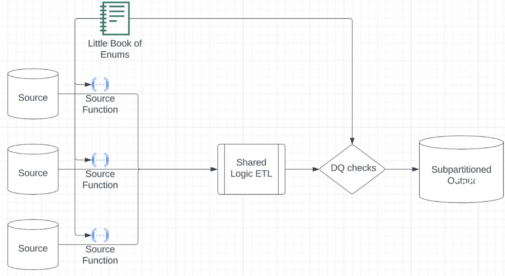
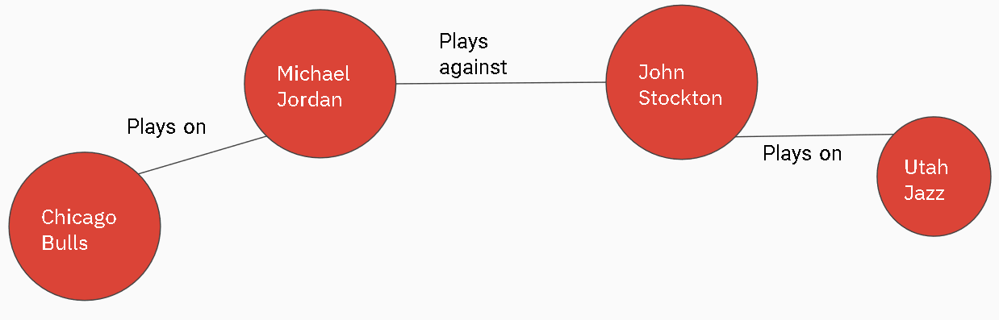

# Dimensional Data Modelling - Graph data modelling & additive dimensions

## Table of Contents

- [Additive vs non-additive dimensions](#additive-vs-non-additive-dimensions)
- [Power of Enums](#power-of-enums)
- [Flexible schemas - model data from disparate sources into a shared schema](#flexible-schemas---model-data-from-disparate-sources-into-a-shared-schema)
- [Data agnostic Graph data modeling](#data-agnostic-graph-data-modeling)
- [Workshop/Lab](#workshoplab)

## Additive vs non-additive dimensions

**Used in user counting in Growth analytics.**

- Additive dimensions mean that you don't **double count**
- For example, age is **additive**
  - The grand total population is equal to 20 year olds + 30 year olds + 40 year olds...
- Aggregating over SUM is **additive**:
  - Number of miles driven by Honda driver is additive = # of miles driven by Civic drivers + # of miles driven by Corolla driver + # of miles driven by Accord drivers...
- Aggregating over COUNT is **NOT additive**:
  - Application interface is **NOT additive**: A user can access from web & app.
    - The number of active users != # of users on web + # of users on Android + # of users on iPhone
  - Counting drivers by cars is **NOT additive**: one driver can 2 or more cars.
    - The number of Honda drivers != # of Civic drivers + # of Corolla driver + # of Accord drivers...
- Ratio metric is also **NOT additive**: # of miles driven / driver

### The essential nature of additivity

A dimension is additive over a specific window of time, if and only if, the grain of data over that window can only ever be one value at a time!
At any instant/second it might be true that: "The number of active users = # of users on web + # of users on Android + # of users on iPhone"

### How does additivity help?

- You don't need to use COUNT(DISTINCT) on pre-aggregated dimensions
- Remember non-additive dimensions are usually only non-additive with respect to COUNT & RATIO aggregations but not SUM aggregations

**Can a user be 2 of these at a given time/day?**
- No: Additive. You can use partial aggregation.
- Yes: NOT additive

## Power of Enums

- Enums are great for low-to-medium cardinality.
  - Preferred to have **< 50 values**.
  - e.g., notification channel.
- Country is a great example of where Enums start to struggle.

### enums benefits

- Built in data quality: Pipeline fails if a new value encountered.
- Built in static fields
- Built in documentation: Easy to get all possible values.

### Enumerations and subpartitions

- Enumerations make amazing subpartitions because
  - You have an exhaustive list
  - They chunk up the big data problem into manageable pieces
- The little book of pipelines [example](https://github.com/EcZachly/little-book-of-pipelines)



- **n number of sources**: 
- **Source function** map data to a shared schema
- **Shared Logic ETL** calls source function which maps it into shared schema
- **Little Book of Enums** stores all enumerated values, also has quality checks for enumerated value.
  - To Source function, you pass book as Python code.
  - To DQ checks, you pass it as a table.
- **Sub-partitioned output**: First partitioned by date and then partitioned by an enum value.

### enum pattern use cases

**Large scale integration**:
- All the source data ends up being in same table
- Whenever you have tons of sources mapping to a shared schema
- Examples:
  - Airbnb:
    - Unit Economics (fees, coupons, credits, insurance, infrastructure cost, taxes, etc)
  - Netflix:
    - Infrastructure Graph (applications, databases, servers, code bases, CI/CD jobs, etc)
  - Facebook
    - Family of Apps (oculus, instagram, facebook, messenger, whatsapp, threads, etc)

## Flexible schemas - model data from disparate sources into a shared schema

You don't want bring all columns from all tables and end up a table with 500 columns where most of them are NULL most of the times.

Flexible schema: leverages Map data types. Overlaps with Graph.
- Benefits
  - If you need to add more sources, then you simply add them into the map. 65K keys limit in Spark.
  - You don't have to run `ALTER TABLE` commands
  - You can manage a lot more columns
  - Your schemas don't have a ton of **NULL** columns. No NULL columns, as those columns will simply not be in the map.
  - **Other_properties** column is pretty awesome for rarely-used-but-needed columns
- Drawbacks
  - Compression is usually worse, (especially if you use JSON)
  - Readability, query ability

## Data agnostic Graph data modeling

Graph modeling is **RELATIONSHIP** focused, not **ENTITY** focused.
<br>Focus is shifted from "What things are" to "How things are connected".
<br>We don't care about columns, as it is RELATIONSHIP focussed.

Because of this, you can do a very poor job at modeling the entities.
<br>All Graph databases will always have same schema.
- Usually the **Vertex schema** model looks like
  - Identifier: STRING. e.g., name
  - Type: STRING. e.g., Player
  - Properties of that vertex/node: MAP<STRING, STRING>. e.g., Height, Weight, year drafted
- The relationships are modeled a little bit more in depth
  - Usually the **edge schema** model looks like
    - subject_identifier: STRING. e.g., Person doing the thing
    - Subject_type: VERTEX_TYPE. e.g., Player
    - Object_identifier: STRING. e.g., Team for which subject plays 
    - Object_type: VERTEX_TYPE. e.g., Team
    - Edge_type: EDGE_TYPE. Almost always a verb, e.g., plays with, is a, has a, plays with, plays against
    - Properties of that relationship: MAP<STRING, STRING>. e.g., years with team: 10

Edge takes 2 vertexes and links them using an Edge_type



## Workshop/Lab

In the lab today we'll be building a graph data model out of the NBA data sets we've been working with so far!
<br>Postgres doesn't have MAP, hence we will use JSON, which is like MAP.

[Graph Data Model](lecture-lab/graph_ddls.sql)

```sql
CREATE TYPE vertex_type
    AS ENUM('player', 'team', 'game');

CREATE TABLE vertices (
    identifier TEXT,
    type vertex_type,
    properties JSON,
    PRIMARY KEY (identifier, type)
);

CREATE TYPE edge_type AS
    ENUM ('plays_against',
          'shares_team',
          'plays_in',
          'plays_on'
        );

CREATE TABLE edges (
    subject_identifier TEXT,
    subject_type vertex_type,
    object_identifier TEXT,
    object_type vertex_type,
    edge_type edge_type,
    properties JSON,
    PRIMARY KEY (subject_identifier,
                subject_type,
                object_identifier,
                object_type,
                edge_type)
)
```

### Vertices table

```sql
# Game vertex
INSERT INTO vertices
SELECT
    game_id AS identifier,
    'game'::vertex_type AS type,
    json_build_object(
        'pts_home', pts_home,
        'pts_away', pts_away,
        'winning_team', CASE WHEN home_team_wins = 1 THEN home_team_id ELSE visitor_team_id END
    ) AS properties
FROM games;


# Player vertex from game_details table
INSERT INTO vertices
WITH players_add AS (
  SELECT
      player_id AS identifier,
      MAX(player_name) AS player_name,
      COUNT(1) as number_of_games,
      SUM(pts) AS total_points,
      ARRAY_AGG(DISTINCT team_id) AS teams
  FROM game_details
  GROUP BY player_id
)

SELECT
    identifier,
    'player'::vertex_type AS type,
    json_build_object(
        'player_name', player_name,
        'number_of_games', number_of_games,
        'total_points', total_points,
        'teams', teams
    ) AS properties
FROM players_add


# [Team vertices](lecture-lab/team_vertices.sql)
INSERT INTO vertices
WITH teams_deduped AS (
    SELECT *, ROW_NUMBER() OVER(PARTITION BY team_id) as row_num
    FROM teams
)
SELECT
    team_id AS identifier,
    'team'::vertex_type AS type,
    json_build_object(
        'abbreviation', abbreviation,
        'nickname', nickname,
        'city', city,
        'arena', arena,
        'year_founded', yearfounded
    )
FROM teams_deduped
WHERE row_num = 1;


SELECT type, COUNT(1)
FROM vertices
GROUP BY 1;
```

## Edges table

```sql
# [Player - team edges](lecture-lab/player_game_edges.sql)
INSERT INTO edges
WITH deduped AS (
    SELECT *, row_number() over (PARTITION BY player_id, game_id) AS row_num
    FROM game_details
)
SELECT
    player_id AS subject_identifier,
    'player'::vertex_type as subject_type,
    game_id AS object_identifier,
    'game'::vertex_type AS object_type,
    'plays_in'::edge_type AS edge_type,
    json_build_object(
        'start_position', start_position,
        'pts', pts,
        'team_id', team_id,
        'team_abbreviation', team_abbreviation
        ) as properties
FROM deduped
WHERE row_num = 1;


SELECT
    v.properties->>'player_name',
    MAX(CAST(e.properties->>'pts' AS INTEGER))
FROM vertices v
    JOIN edges e
        ON e.subject_identifier = v.identifier
        AND e.subject_type = v.type
GROUP BY 1
ORDER BY 2 DESC;


# [Player - player played against edges](lecture-lab/player_player_edges.sql)
INSERT INTO edges
WITH deduped AS (
    SELECT *, row_number() over (PARTITION BY player_id, game_id) AS row_num
    FROM game_details
),
     filtered AS (
         SELECT * FROM deduped
         WHERE row_num = 1
     ),
     aggregated AS (
          SELECT
           f1.player_id AS subject_player_id,
           f2.player_id AS object_player_id,
           CASE WHEN f1.team_abbreviation = f2.team_abbreviation
                   THEN 'shares_team'::edge_type
               ELSE 'plays_against'::edge_type
           END AS edge_type,
           MAX(f1.player_name) AS subject_player_name,
           MAX(f2.player_name) AS object_player_name,
           COUNT(1) AS num_games,
           SUM(f1.pts) AS subject_points,
           SUM(f2.pts) as object_points
        FROM filtered f1
            JOIN filtered f2
            ON f1.game_id = f2.game_id
            AND f1.player_name <> f2.player_name
        WHERE f1.player_id > f2.player_id
        GROUP BY
           f1.player_id,
           f2.player_id,
           CASE WHEN f1.team_abbreviation = f2.team_abbreviation
                   THEN 'shares_team'::edge_type
               ELSE 'plays_against'::edge_type
           END
     )
     
SELECT
    subject_player_id AS subject_identifier,
    'player'::vertex_type AS subject_type,
    object_player_id AS object_identifier,
    'player'::vertex_type AS object_type,
    edge_type AS edge_type,
    json_build_object(
        'num_games', num_games,
        'subject_points', subject_points,
        'object_points', object_points
    )
FROM aggregated;


SELECT
    v.properties->>'player_name',
    e.object_identifier AS object_identifier,
    CAST(v.properties->>'number_of_games' AS REAL) /
        CASE WHEN CAST(v.properties->>'number_of_games' AS REAL) = 0 THEN 1 ELSE CAST(v.properties->>'number_of_games' AS REAL) END
        
    MAX(CAST(e.properties->>'subject_points' AS INTEGER)),
    MAX(CAST(e.properties->>'num_games' AS INTEGER))
FROM vertices v
    JOIN edges e
        ON e.subject_identifier = v.identifier
        AND e.subject_type = v.type
WHERE e.object_type = 'player'::vertex_type;
```
