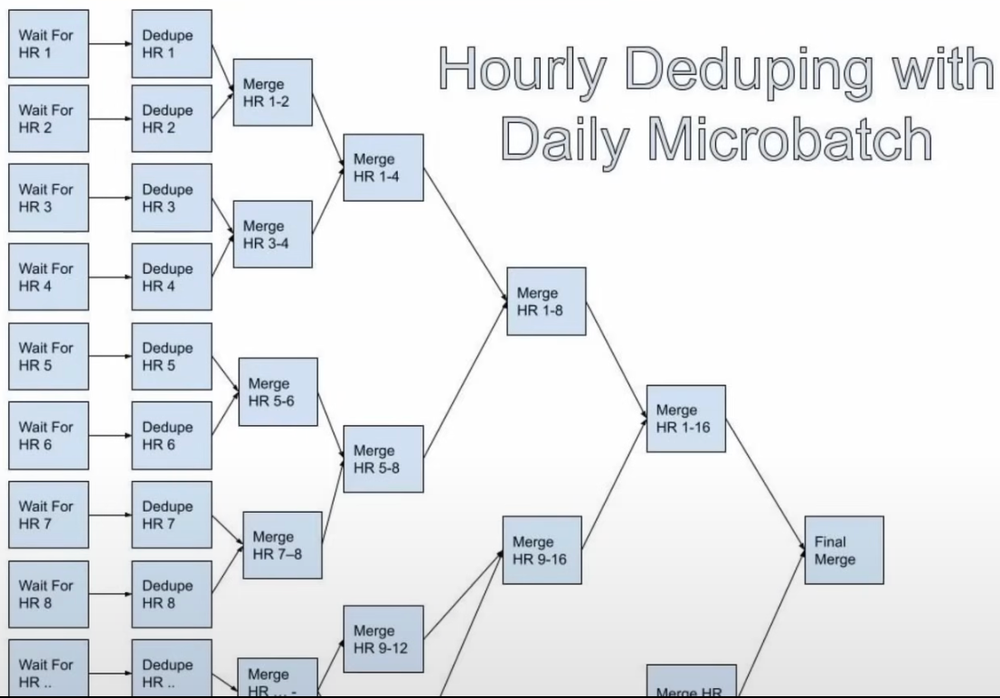

# Fact Data Modeling

This repo follows the same setup as week 1. Please go to the dimensional data modeling [README](../1-dimensional-data-modeling/README.md) for instructions.


## Table of Contents

- [What is a fact?](#what-is-a-fact)
- [What makes fact modeling hard?](#what-makes-fact-modeling-hard)
- [How does fact modeling work?](#how-does-fact-modeling-work)
- [Raw logs vs fact data](#raw-logs-vs-fact-data)
- [Fact modeling work - Who, What, Where, When, and How](#fact-modeling-work---who-what-where-when-and-how)
- [When should you model in dimensions?](#when-should-you-model-in-dimensions)
- [How does logging fit into fact data?](#how-does-logging-fit-into-fact-data)
- [Potential options when working with high volume fact data](#potential-options-when-working-with-high-volume-fact-data)
- [How long should you hold onto fact data?](#how-long-should-you-hold-onto-fact-data)
- [Deduplication of fact data](#deduplication-of-fact-data)
  - [Streaming to deduplicate facts](#streaming-to-deduplicate-facts)
  - [Hourly Microbatch Dedupe](#hourly-microbatch-dedupe)
  - [Hourly Deduping with Daily Microbatch](#hourly-deduping-with-daily-microbatch)
- [Workshop - Day 01](#workshop---day-01)

## What is a fact?

Think of a fact as something that happened or occurred.
- A user logs in to an app
- A transaction is made
- You run a mile with your fitbit

Facts are not slowly changing which makes them easier to model than dimensions in some respects.

## What makes fact modeling hard?

- Fact data is usually 10-100x the volume of dimension data
  - Facebook had 2B active users when I worked there and sent 50B notifications every day
- Fact data can need a lot of context for effective analysis.
  - **Funnel analysis** is a good example of this: What other fact data or dimensions do we need to make this analysis effective?
    - We sent a notification, which will not have any significance in isolation.
    - We need to know who we sent it to, what the notification was, and what the user did after receiving it.
    - The user then clicked on notification.
    - Later, if he purchased something, we need to know what he purchased, etc.
- Duplicates in facts are way more common than in dimensional data
  - Due to a bug, we might send the same notification twice to the same user.
  - Multiple clicks on the same notification, which we don't want to count as 2 for analysis

## How does fact modeling work?

- Normalization vs Denormalization
  - Normalized facts don't have any dimensional attributes, just IDs to join to get that information
    - Better when scales are small and you want to save storage
    - This is bad when you want to do quick analysis and have to join a lot of tables
    - e.g., user_id x notification_id x purchase_id
  - Denormalized facts have some dimensional attributes in them for quicker analysis
    - Denormalized facts bring in some dimensional attributes for quicker analysis at the cost of more storage
    - e.g., user_id x notification_id x purchase_id x user_name x notification_text x purchase_amount
- Both normalized and denormalized facts have a place in this world!

## Raw logs vs fact data

Fact data and raw logs are not the same thing
- Raw logs
  - Ugly schemas designed for online systems that make data analysis sad
  - Potentially contains duplicates and other quality errors
  - Usually have shorter retention
- Fact data
  - Nice column names
  - Quality guarantees like uniqueness, not null, etc
  - Longer retention

## Fact modeling work - Who, What, Where, When, and How

Think of this as a few Who, What, Where, When, and How
- "Who" fields are usually pushed out as IDs (this user clicked this button, we only hold the user_id not the entire user object)
- "Where" fields: Where did this happen? (e.g., country, city, location, which page in website, profile page, etc)
  - Most likely modeled out like Who with "IDs" to join, but more likely to bring in dimensions, especially if they're high cardinality like "device_id"
- "How" fields: How did this happen? (e.g., user_id, notification_id, purchase_id, user_agent, ip_address)
  - How fields are very similar to "Where" fields. "He used an iphone to make this click"
    How does fact modeling work
- "What" fields are fundamentally part of the nature of the fact. Should be at atomic level (not at aggregate level)
  - In notification world - "GENERATED", "SENT", "CLICKED", "DELIVERED"
- "When" fields are fundamentally part of the nature of the fact
  - Mostly an "event_timestamp" field or "event_date"
  - Client side logging mostly happen in client TZ, so make sure that client sends logs in UTC, which is stored in server again in UTC

Fact datasets should have quality guarantees. If the didn't, analysis would just go to the raw logs!
- No duplicates
- Mandatory field: What, who & when fields.
- Fact data should generally be smaller than raw logs.
- Fact data should parse out hard-to-understand columns!. e.g., No major blobs; JSON to simple data types. Can have array of strings (experimentation data)

## When should you model in dimensions?

Example
- Network logs pipeline: Network traffic: Every single network request in Netflix
- The largest pipeline ive ever worked on. Over 100 TBs/hr
- We wanted to see which microservice app each network request came from and went to
- Modeling this as a traditional fact data
- IP address would be the identifier for the app
- This worked for IPv4 domains because the cardinality was small enough
  - Spark Broadcast JOIN was feasible as one side of JOIN was small enough to be broadcasted (< 5-6 GB)
- This pipeline design couldn't be used to support IPv6 domains though because that search space was too large to be broadcasted.

The slam dunk solution here was to log to the "app" field with each network request and getting rid of the JOIN entirely.  DENORMALIZATION SAVES THE DAY
- This required each microservice to adopt a "sidecar proxy" that enabled logging of which app they were!
- A large organizational effort to solve this issue

## How does logging fit into fact data?

- Logging brings in all the critical context for your fact data
  - Usually done in collaboration with online system engineers
- Don't log everything!
  - Log only what you really need
- Logging should conform to data contract/values specified by the online teams
  - Thrift is what is used at Airbnb and Netflix for this
    - Thrift is a serialization framework that can be used to define schema/data types and service interfaces in a language-neutral way
    - Ruby code & Scala code will reference to same Thrift schema, hence any new column added to schema will be available to both Ruby & Scala code

## Potential options when working with high volume fact data

- Sampling
  - Doesn't work for all use cases, works best for metric-driven use-cases where imprecision isn't an issue
  - Not possible in security or low probability events
  - Law of large numbers: If you sample enough, you can get a good estimate or directionality; Gaussean distribution
- Bucketing
  - Fact data can be bucketed by one of the important dimensions (usually "who" IDs: user_id)
  - Bucket joins can be much faster than shuffle joins: Help minimize the amount of data that needs to be shuffled
  - **Sorted-merge Bucket (SMB)** joins can do joins without Shuffle at all! Both sides of the join are sorted and merged together.
    - Not used much now a days.

## How long should you hold onto fact data?

- High volumes make fact data much more costly to hold onto for a long time
- Big tech had an interesting approach here
  - Any fact tables <10 TBs, Retention didn't matter much
    - Anonymization of facts usually happened after 60-90 days though and the data would be moved to a new table with the PII stripped
  - Any fact tables >100 TBs, VERY SHORT RETENTION (~14 days or less)

## Deduplication of fact data

- Facts can often be duplicated
  - You can click a notification multiple times
- How do you pick the right window for deduplication?
  - No duplicates in a day? An hour? A week?
  - Looking at distributions of duplicates here is a good idea
- Intraday deduping options
  - Streaming (like on a minute basis)
  - Microbatching (like on hourly basis)

### Streaming to deduplicate facts

- Streaming allows you to capture most duplicates in a very efficient manner
- Windowing matters here
- Entire day duplicates can be harder for streaming because it needs to hold onto such a big window of memory
- A large memory of duplicates usually happen within a short time of first event
- 15 minute to hourly windows are a sweet spot

### Hourly Microbatch Dedupe

- Used to reduce landing time of daily tables that dedupe slowly
- Worked at Facebook using this pattern
  - Deduplicated 50 billion notification events every day
  - Reduced landing time from 9 hours after UTC to 1 hour after UTC
- Dedupe each hour with GROUP BY for whole day
  - This eliminates duplicates within 1 hour window.
- Use SUM and COUNT to aggregate duplicates, use COLLECT_LIST to collect metadata about the duplicates that might be different!

  ```sql
  SELECT
    product_id,
    event_type,
    MIN(event_timestamp_epoch) as min_event_timestamp_epoch,
    MAX(event_timestamp_epoch) AS max_event_timestamp_epoch,
    MAP_FROM_ARRAYS (
      COLLECT_LIST (event_location),
      COLLECT_LIST (event_timestamp_epoch)
    ) AS event_locations
  FROM event_source
  GROUP BY product_id, event_type
  ```

- Dedupe between hours with FULL OUTER JOIN like branches of a tree
  - Between hours 0 & 1; between hours 1 & 2, so on
- Use left.value + right.value to keep duplicates aggregation correctly counting or CONCAT to build a continuous list

  ```sql
  WITH earlier AS (
    SELECT * FROM hourly_deduped_source
    WHERE {ds_str} AND hour = (earlier_hour) AND product_name = {product_name)
  ),
  later AS (
    SELECT * FROM hourly_deduped_source
    WHERE {ds_str} AND hour = {later_hour) AND product_name = {product_name}
  )
  
  SELECT
    COALESCE(e.product_id, l.product_id) as product_id,
    COALESCE(e.event_type, l.event_type) AS event_type,
    COALESCE(e.min_event_timestamp_epoch, l.min_event_timestamp_epoch) as min_event_timestamp_epoch,
    COALESCE(l.max_event_timestamp_epoch, e.max_event_timestamp_epoch) AS max_event_timestamp_epoch,
    CONCAT (e.event_locations, l.event_locations) as event_locations
  FROM earlier e
    FULL OUTER JOIN later 1
      ON e.product_id = l.product_id
      AND e.event_type = l.event_type;
  ```
  


## Workshop - Day 01

1. Were going to use the 'games and 'game_details for today's lab
2. We have three entities here
   - Team (low cardinality)
   - Games (high cardinality, should model dimensions in)
   - Players (medium cardinality)

We will be building facts datasets.

```sql
SELECT * FROM game_details;

# First we figure out grainularity/atomic level of the fact: For every game, every team, every player: that's kind of unique identifier here:
# Then we find if there are any dupes in the table for this grainularity:
SELECT
  game_id, team_od, player_id, COUNT(1)
FROM game_details
GROUP BY 1, 2, 3
HAVING COUNT(1) > 1;


# We will create a filter to get rid of duplicates:
WITH deduped AS
(
  SELECT
    *, ROW_NUMBER() OVER (PARTITION BY game_id, team_id, player_id ORDER BY event_timestamp) AS row_num
  FROM game_details
)

SELECT * FROM deduped
# ORDER BY row_num DESC;
WHERE row_num = 1;
```

There is no "when" column at all.
<br>>We will get it from game table, so we will JOIN it with game table

```sql
CREATE TABLE fct_game_details (
  dim_game_date DATE,   # dim_ is for dimension; these are columns you should filter on and GROUP BY on
  dim_season INTEGER,
  dim_team_id INTEGER,
  dim_player_id INTEGER,
  dim_player_name TEXT,
  dim_start_position TEXT,
  dim_is_playing_at_home BOOLEAN,
  dim_did_not_play BOOLEAN,
  dim_did_not_dress BOOLEAN,
  dim_not_with_team BOOLEAN,
  m_minutes REAL,     # m_ is for measure; Used for aggregate and map to fact data
  m_fgm INTEGER,
  m_fga INTEGER,
  m_fg3m INTEGER,
  m_fg3a INTEGER,
  m_ftm INTEGER,
  m_fta INTEGER,
  m_oreb INTEGER,
  m_dreb INTEGER,
  m_reb INTEGER,
  m_ast INTEGER,
  m_stl INTEGER,
  m_blk INTEGER,
  m_turnovers INTEGER,
  m_pf INTEGER,
  m_pts INTEGER,
  m_plus_minus INTEGER,
  PRIMARY KEY (dim_game_date, dim_team_id, dim_player_id);
  
INSERT INTO fact_game_details
WITH deduped AS (
  SELECT
    g.game_date_est,
    g.season,
    g.home_team_id,
    gd.*,
    ROW_NUMBER OVER (PARTITION BY gd.game_id, team_id, player_id ORDER BY g.game_date_est) AS row_num
  FROM game_details gd
    JOIN games g on gd.game_id = g.game_id
  # WHERE g.game_date_est = '2016-10-04'
)

# We will omit columns for fact data that are not needed for analysis or that are easy to get by JOINing with game_details table (like team_abbreviation, team_city, considering number of teams is quite small)
SELECT
  game_date_est AS dim_game_date,
  season AS dim_season,
  team_id AS dim_team_id,
  player_id AS dim_player_id,
  player_name AS dim_player_name,
  start_position AS dim_start_position,
  team_id = home_team_id AS dim_is_playing_at_team,
  COALESCE(POSITION('DNP' in comment), 0) > 0 AS dim_did_not_play,
  COALESCE(POSITION('DND' in comment), 0) > 0 AS dim_did_not_dress,
  COALESCE(POSITION('NWT' in comment), 0) > 0 AS dim_not_with_team,
  # comment,
  (CAST(SPLIT_PART(min, ':', 1) AS REAL)
    + CAST(SPLIT_PART(min, ':', 2) AS REAL))/60
    AS minutes # string minutes to fractionals
  fgm AS m_fgm,
  fga AS m_fga,
  fg3m AS m_fg3m,
  fg3a AS m_fg3a,
  ftm AS m_ftm,
  fta AS m_fta,
  oreb AS m_oreb,
  dreb AS m_dreb,
  reb AS m_reb,
  ast AS m_ast,
  stl AS m_stl,
  blk AS m_blk,
  "TO" AS m_turnovers,
  pf AS m_pf,
  pts AS m_pts,
  plus_minus AS m_plus_minus
FROM deduped
WHERE row_num = 1;

SELECT * FROM fact_game_details;

# Now we will JOIN this with a small teams table to get team name and other columns that we omitted earlier is a quick time
SELECT t.*, gd.*
FROM fct_game_details gd JOIN teams t
  ON t. team_id = gd.dim_team_id;
  
# Most bailed out player
SELECT
  dim_player_name,
  COUNT(1) AS num_games,
  COUNT(CASE WHEN dim_not_with_team THEN 1 END) AS bailed_num,
  CAST(COUNT(CASE WHEN dim_not_with_team THEN 1 END) AS REAL) / COUNT(1) AS bailed_pct
FROM fct_game_details
GROUP BY 1
ORDER BY 4 DESC;

# Most bailed out player at home
SELECT
  dim_player_name,
  dim_is_playing_at_home,
  COUNT(1) AS num_games,
  SUM(m_pts) AS total_points,
  COUNT(CASE WHEN dim_not_with_team THEN 1 END) AS bailed_num,
  CAST(COUNT(CASE WHEN dim_not_with_team THEN 1 END) AS REAL) / COUNT(1) AS bailed_pct,
  SUM(m_pts) AS total_points
FROM fct_game_details
GROUP BY 1,2
ORDER BY 6 DESC;
```
