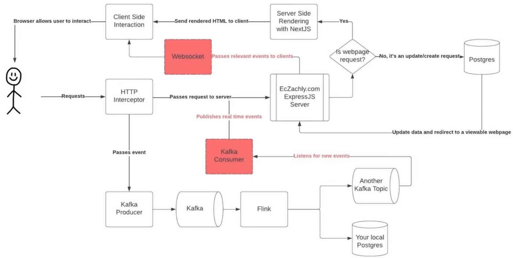
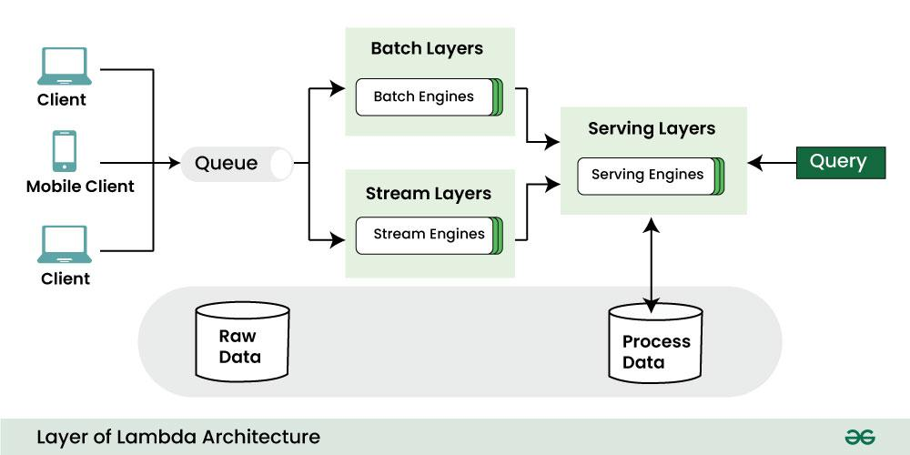

# Week 4 Apache Flink Streaming Pipelines

## Lecture 1 Slides

### What's the difference between streaming, near real-time and real-time?

- Streaming (or continuous)
    - Data is processed as it is generated
    - Example: Flink
- Near real-time
    - Data is processed in small batches every few minutes
    - Example: Spark Structured Streaming

- Real-time and streaming are often synonymous but not always!
    - Less technical people might think real-time and batch are synonymous!

## Should you use streaming?

- Skills on the team
- What is the incremental benefit?
- Homogeneity of your pipelines
    - Kappa architecture: all data is processed in the streaming way by Uber
- The tradeoff between daily batch, hourly batch, microbatch, and streaming.
- How should data quality be inserted (batch pipelines have easier DQ paths)
    - Harder thing to do, as difficult to stop and fix a streaming pipeline

## Streaming-only Use Cases

**LOW LATENCY MAKES OR BREAKS THE USE CASE**
- Detecting fraud, preventing bad behavior
- High-frequency trading
- Live event processing: Sports, concerts, etc.

## Gray-area use cases (micro-batch may work too)

- Data that is served to customers
- Reducing the latency of upstream master data
    - Notifications dataset had an 9 hour after midnight latency
    - Micro batch cut it to 1 hour
- Load on processing s more uniform. Better use of cloud resources.

## Gray-area use cases (micro-batch may work too)

- Data that is served to customers
- Reducing the latency of upstream master data
- Notifications dataset had an 9 hour after midnight latency
  • Micro batch cut it to 1 hour

## No-go Streaming use cases (use batchWatch Later please!)

- Ask the question
    - What is the incremental benefit of reduced latency?
- Analysts complaining that the data isn't up-to-date
    - Yesterday's data by 9 AM is good enough for MOST analytical use cases

## How are streaming pipelines different from batch pipelines?

- Streaming pipelines run 24/7! Batch pipelines run for a small percentage of the day
- Streaming pipelines are much more software engineering oriented
- They act a lot more like servers than DAGs
- Streaming pipelines need to be treated as such and have more unit test and integration test coverage like servers!

## The streaming -> batch continuum


- Real time is a myth!|
    - You'll have seconds of latency just for the event generation -> Kafka -> Flink -> sink
- Pipelines can be broken into 4 categories
    - Daily batch
    - Hourly batch (sometimes called near real-time)
    - Microbatch (sometimes called near real-time)
    - Continuous processing (usually called real-time)

## The structure of a streaming pipeline

- The Sources
    - Kafka (river, firehose), RabbitMQ (message broker, pub-sub)
- Enriched dimensional sources (i.e. Flink side inputs)
    - Regular data from tables to enrich event data
    - Refreshes every 3 hours, or so.
      The structure of a streaming pipeline
- The compute engine
    - Flink
    - Spark Structured Streaming
- The destination, also called "the sink"
- Common sinks
    - Another Kafka topic
    - Iceberg: Allows to append to a partition, instead of overwrite (in Hive)
    - Postgres

## Streaming challenges

- Out of order events
  - Watermarking in Flink: 15 seconds buffer will allow out-of order events to be processed
  - Flink will fix the ordering for you in that buffer automatically.
- Late arriving data
  - How late is too late?
  - Batch handles this mostly by waiting, although batch has issues around midnight UTC too!
- Recovering from failures
  - Flink manages this in a few ways
    - Offsets
      - Earliest offset
      - Latest offset
      - Specific timestamp (maybe like when it failed)
    - Checkpoints: every n seconds. Internal to Flink. 
    - Savepoints:
      - External to Flink: like a CSV file.
      - Used for Flink itself.
      - Can be used to restore the state of a job
      - Can be used to upgrade a job
      - Can be used to move a job to a different cluster

## Lecture 2 Slides

### Sample streaming pipeline:


- HTTP Interceptor is our **Data Generation** layer.
- Kafka is our **Data Ingestion** layer.
- Flink is our **Real-time Data Processing** layer.
- Postgres is our **Data Storage** layer.

### Future version (data product) of the pipeline:

A **closed loop** system where the data is used to make decisions and then fed back into the system.



### Data architectures


#### Lambda Architecture




- Lambda architecture is designed to handle both batch and real-time data processing in a single system.
- You have both batch pipeline and a streaming pipeline, that write the same data to the same sink.
  - Batch pipeline is a backup for a failure/incorrectness in streaming pipeline
- Optimizes for latency and correctness
- Eats a bit of pain in complexity
- **Three layers**: batch, speed, and serving
  - Batch layer processes large volumes of historical data. Historical, slow, correct, complex, and expensive, but can be used to fix data quality issues.
    - Hadoop, Spark, Hive, Impala
    - Data is processed in batch and stored in a distributed file system and/or data warehouse
  - Speed layer handles real-time data streams. Real-time, fast, approximate, simple, and cheap
    - Kafka, Flink
    - Data is processed in real-time and stored in a key-value store
  - Serving layer combines results from both layers
- Pros:
  - Easier to insert data quality checks on the batch side
  - Handles both real-time and batch processing efficiently
  - Highly scalable and fault-tolerant
  - Ensures data integrity through the batch layer
- Cons:
  - Increased complexity due to maintaining two separate processing systems
  - Duplication of business logic across layers: Double code base
  - Potential latency in the batch layer
- Example
  - A large e-commerce platform using **Hadoop** for batch processing of historical sales data and **Apache Storm** for real-time processing of current user activity.
- Netflix uses this architecture

#### Kappa Architecture

**Streaming first**: You don't need both batch and streaming pipelines. You can use just a streaming pipeline.
It simplifies Lambda by using a single real-time processing pipeline for all data.
- Features
  - Single processing pipeline for both real-time and batch data
  - Uses a stream processing system as the core engine
  - Reprocessing is done by replaying the data through the same pipeline
- Pros
  - Least complex
  - Great latency wins
  - Simplified system with a single code base
  - Reduced complexity and maintenance overhead
  - Faster and more consistent results
- Cons
  - Can be painful when you need to read a lot of history
  - You need to read things sequentially
  - Back-filling a lot of historical data can be painful
  - May require more resources and tuning for reliability
  - Can be challenging for complex batch processing tasks
  - Limited by the capabilities of the chosen stream processing framework
- Example:
  - A social media analytics platform using **Apache Kafka** for data ingestion and **Apache Flink** for all data processing, both real-time and historical.
  - Uber uses this architecture
- Delta Lake, Iceberg, Hudi are making this architecture much more viable!
- Flink pipeline with a single code base can run either in batch or streaming mode.
  - Flink can dump data to Iceberg with partitions, and then you can back-fill data by 1 day at a time.
  - Iceberg allows appending data to a partition, instead of overwriting it (like in Hive).

### Flink UDFs

- User Defined Functions (UDFs) are functions that can be defined by the user to perform operations on the data.
- Flink provides a rich set of built-in functions that can be used to perform operations on the data.
- UDFs can be used to perform complex operations on the data that are not supported by the built-in functions in Flink, such as **custom** Transforming, Filtering, Aggregating, Joining the data, etc.
- UDFs can be used in the operations like Map, FlatMap, Filter, Reduce, Aggregate, Join, CoGroup, Cross, etc.
- Flink supports UDFs in Java, Scala, and Python.
  - Flink provides a set of interfaces that can be implemented to create UDFs in Java and Scala.
- UDFs generally speaking won't perform as well as built-in functions
- Python UDFs are going to be even less performant since Flink isn't native Python!
  - When you use Python UDFs, Flink will serialize the data to Python using Apache Arrow, run the UDF in a separate Python process, and then serialize it (using Arrow) and send it back to Java.

### Flink Windows

#### Data-driven Windows

##### Count-driven Windows

- Window opens as soon 1st event is received
- Window stays open until N number of events occur
- **Funnel analytics**: Useful for funnels that have a predictable number of events.
  - Example: User registration funnel
    - User visits the site
    - User signs up
    - User confirms email
    - User makes a purchase
- Can specify a timeout since not everybody will finish the funnel: 1000 events or 1 hour, whichever comes first

#### Time-driven Windows

##### Tumbling Windows (no overlap)


- Fixed-size, non-overlapping windows
- Similar to hourly data in batch processing
- Greate for chunking/aggregating data over fixed time intervals
- Window starts at a fixed point in time and ends after a fixed duration
- Example:
  - 1-hour tumbling window
  - Total number of events in the last hour
  - Average temperature in the last 5 minutes
  - Total number of events in the last 5 minutes

##### Sliding Windows (with overlap)


- Fixed-size, overlapping windows
- We are not trying to aggregate all these windows, but trying to find one with max events, etc.
- Captures more windows
- Good for finding "peak-use" windows
- Good at handling "across midnight" exceptions in batch
  - Edge cases around 00:00 UTC when we want daily data
- Niche, specific use case

##### Session Windows (punctuated by a gap of inactivity)


- User specific windows: It starts when the user starts interacting with the system and ends when the user stops interacting with the system for a gap of time.
- Variable length
- Based on activity
- Used to determine "normal" user behavior

### Allowed Lateness vs Watermarking

Out of order or late arriving events
- Watermarks (smaller than the window) are used to handle out-of-order events
  - Flink uses watermarks to track the progress of event time
  - A watermark is a declaration that by that point in the stream, all events up to a certain timestamp should have arrived.
  - Once a watermark reaches an operator, the operator can advance its internal event time clock to the value of the watermark.
  - Watermarks are used to determine when a computational window can be closed and executed
  - Helps define ordering of events that arrive out-of-order
  - Handles idleness too
- Allowed Lateness (larger than the window) is used to handle late arriving events
  - Usually set to O: By default, late elements are dropped when the watermark is past the end of the window.
  - Allows for reprocessing of events that fall within the late window
  - Elements that arrive after the watermark has passed the end of the window but before it passes the end of the window plus the allowed lateness, are still added to the window.
  - Depending on the trigger used, a late but not dropped element may cause the window to fire again.
  - Flink keeps the state of windows until their allowed lateness expires. Once this happens, Flink removes the window and deletes its state
  - CAUTION: WILL GENERATE/MERGE WITH OTHER RECORDS

## Apache Flink Training

### :pushpin: Getting started 

#### :whale: Installations

To run this repo, the following components will need to be installed:

1. [Docker](https://docs.docker.com/get-docker/) (required)
2. [Docker compose](https://docs.docker.com/compose/install/#installation-scenarios) (required)
3. Make (recommended) -- see below
    - On most Linux distributions and macOS, `make` is typically pre-installed by default. To check if `make` is installed on your system, you can run the `make --version` command in your terminal or command prompt. If it's installed, it will display the version information. 
    - Otherwise, you can try following the instructions below, or you can just copy+paste the commands from the `Makefile` into your terminal or command prompt and run manually.

        ```bash
        # On Ubuntu or Debian:
        sudo apt-get update
        sudo apt-get install build-essential

        # On CentOS or Fedora:
        sudo dnf install make

        # On macOS:
        xcode-select --install

        # On windows:
        choco install make # uses Chocolatey, https://chocolatey.org/install
        ```

#### :computer: Local setup

Clone/fork the repo and navigate to the root directory on your local computer.

```bash
git clone https://github.com/DataExpert-io/data-engineer-handbook.git
cd bootcamp/materials/4-apache-flink-training
```

#### :dizzy: Configure credentials

1. Copy `example.env` to `flink-env.env`.

    ```bash
    cp example.env flink-env.env
    ```

2. Use `vim` or your favorite text editor to update `KAFKA_PASSWORD`, `KAFKA_GROUP`, `KAFKA_TOPIC`, and `KAFKA_URL` with the credentials in the `flink-env.env`

    ```bash
    vim flink-env.env
    ```
    
    **:exclamation: Please do *not* push or share the environment file outside the bootcamp as it contains the credentials to cloud Kafka resources that could be compromised. :exclamation:**

    Other notes ~

    → _You can safely ignore the rest of the credentials in the `flink-env.env` file in Discord since the repo has since been updated and everything else you need is conveniently included in the `example.env`._

    → _You might also need to modify the configurations for the containerized postgreSQL instance such as `POSTGRES_USER` and `POSTGRES_PASSWORD`. Otherwise, you can leave the default username and password as `postgres`._


### :boom: Running the pipeline

1. Build the Docker image and deploy the services in the `docker-compose.yml` file, including the PostgreSQL database and Flink cluster. This will (should) also create the sink table, `processed_events`, where Flink will write the Kafka messages to.

    ```bash
    make up

    #// if you dont have make, you can run:
    # docker compose --env-file flink-env.env up --build --remove-orphans  -d
    ```

    **:star: Wait until the Flink UI is running at [http://localhost:8081/](http://localhost:8081/) before proceeding to the next step.** _Note the first time you build the Docker image it can take anywhere from 5 to 30 minutes. Future builds should only take a few second, assuming you haven't deleted the image since._

    :information_source: After the image is built, Docker will automatically start up the job manager and task manager services. This will take a minute or so. Check the container logs in Docker desktop and when you see the line below, you know you're good to move onto the next step.

    ```
    taskmanager Successful registration at resource manager akka.tcp://flink@jobmanager:6123/user/rpc/resourcemanager_* under registration id <id_number>
    ```
   2. Make sure to run `sql/init.sql` on the postgres database from Week 1 and 2 to have the `processed_events` table appear
3. Now that the Flink cluster is up and running, it's time to finally run the PyFlink job! :smile:

    ```bash
    make job

    #// if you dont have make, you can run:
    # docker-compose exec jobmanager ./bin/flink run -py /opt/src/job/start_job.py -d
    ```

    After about a minute, you should see a prompt that the job's been submitted (e.g., `Job has been submitted with JobID <job_id_number>`). Now go back to the [Flink UI](http://localhost:8081/#/job/running) to see the job running! :tada:

4. Trigger an event from the Kafka source by visiting [https://bootcamp.techcreator.io/](https://bootcamp.techcreator.io/) and then query the `processed_events` table in your postgreSQL database to confirm the data/events were added.

    ```bash
    make psql
    # or see `Makefile` to execute the command manually in your terminal or command prompt

    # expected output:
    docker exec -it eczachly-flink-postgres psql -U postgres -d postgres
    psql (15.3 (Debian 15.3-1.pgdg110+1))
    Type "help" for help.

    postgres=# SELECT COUNT(*) FROM processed_events;
    count 
    -------
    739
    (1 row)
    ```

5. When you're done, you can stop and/or clean up the Docker resources by running the commands below.

    ```bash
    make stop # to stop running services in docker compose
    make down # to stop and remove docker compose services
    make clean # to remove the docker container and dangling images
    ```

    :grey_exclamation: Note the `/var/lib/postgresql/data` directory inside the PostgreSQL container is mounted to the `./postgres-data` directory on your local machine. This means the data will persist across container restarts or removals, so even if you stop/remove the container, you won't lose any data written within the container.

------

:information_source: To see all the make commands that're available and what they do, run:

```bash
make help
```

As of the time of writing this, the available commands are:

```bash

Usage:
  make <target>

Targets:
  help                 Show help with `make help`
  db-init              Builds and runs the PostgreSQL database service
  build                Builds the Flink base image with pyFlink and connectors installed
  up                   Builds the base Docker image and starts Flink cluster
  down                 Shuts down the Flink cluster
  job                  Submit the Flink job
  stop                 Stops all services in Docker compose
  start                Starts all services in Docker compose
  clean                Stops and removes the Docker container as well as images with tag `<none>`
  psql                 Runs psql to query containerized postgreSQL database in CLI
  postgres-die-mac     Removes mounted postgres data dir on local machine (mac users) and in Docker
  postgres-die-pc      Removes mounted postgres data dir on local machine (PC users) and in Docker
```
